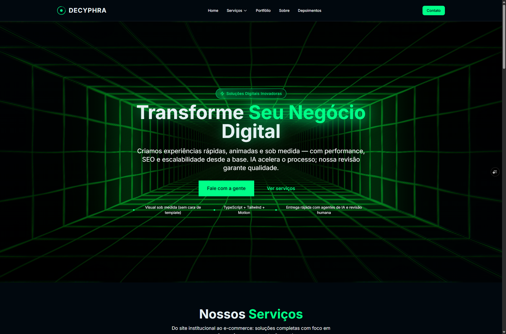
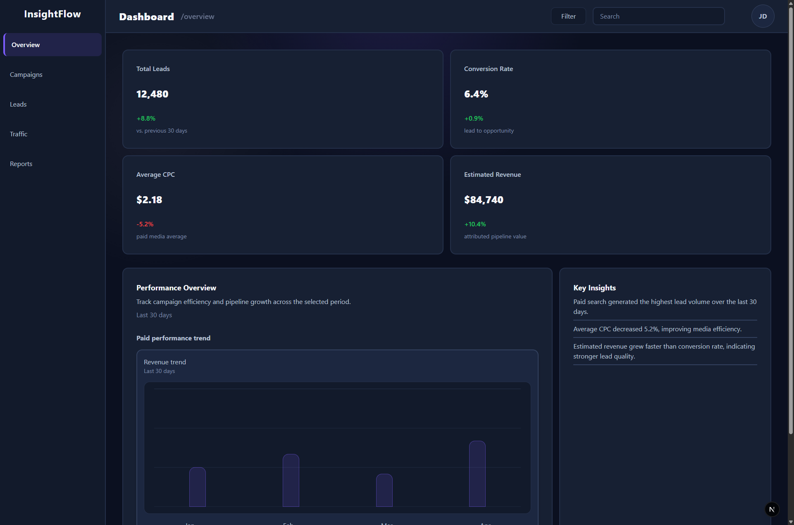

  

  
  
  

## 🇺🇸 About Me

I’m a Full Stack Web Developer focused on building modern, high-performance digital solutions with real business purpose.

My work is centered on creating websites and applications that combine clean architecture, strong UI/UX and strategic thinking, with attention not only to how products look, but also to how they perform, communicate value and guide users toward meaningful actions.

I’m also the founder of Decyphra, a digital project currently in development, where I explore the intersection between technology, design and business. Through this project, I’ve been refining my ability to think beyond implementation alone — approaching web development as a tool to build scalable, conversion-oriented experiences that can support the growth of businesses in a practical way.

At this stage, I continue strengthening my technical foundation through study and hands-on projects, working with technologies such as Next.js, React, TypeScript, Tailwind CSS and PostgreSQL. My goal is to develop solutions that are technically consistent, visually well-crafted and aligned with real-world business needs.

## 🇧🇷 Sobre Mim

Sou um desenvolvedor web full stack focado em construir soluções digitais modernas, de alta performance e com propósito real de negócio.

Meu trabalho está centrado na criação de websites e aplicações que combinam uma arquitetura bem estruturada, UI/UX consistente e pensamento estratégico, com atenção não apenas à estética, mas também à forma como esses produtos performam, comunicam valor e conduzem o usuário a ações relevantes.

Também sou fundador da Decyphra, um projeto digital em desenvolvimento onde exploro a interseção entre tecnologia, design e negócios. Através dele, venho aprimorando minha capacidade de ir além da implementação técnica, enxergando o desenvolvimento web como uma ferramenta para construir experiências escaláveis e orientadas à conversão, capazes de apoiar o crescimento de empresas de forma prática.

Atualmente, sigo fortalecendo minha base técnica por meio de desenvolvimento prático e evolução contínua das minhas habilidades, trabalhando com tecnologias como Next.js, React, TypeScript, Tailwind CSS e PostgreSQL. Meu objetivo é desenvolver soluções que sejam tecnicamente sólidas, visualmente bem construídas e alinhadas às necessidades reais do mercado.

## 🎯 Current Focus

- Building scalable web applications with Next.js and React
- Improving UI/UX with focus on conversion and user behavior
- Developing Decyphra as a real digital solution platform

## 💡 What I Bring

- Strong focus on UI/UX and user behavior
- Clean, scalable and maintainable code structure
- Business-oriented approach to web development
- Attention to performance and conversion

## 🚀 Featured Projects

### 🔹 Decyphra Website

Modern website built to represent a digital agency, focused on performance, clean design and scalability.  
Designed to simulate real business scenarios, with attention to user experience, structure and conversion-oriented layout.

→ Live Demo: https://decyphra.com.br  
→ Repository: https://github.com/JhonnatanAguiar/Decyphra-Project

### 🔹 Analytics Dashboard (In Development)

Dynamic dashboard focused on advanced UI/UX and data visualization, built to explore complex interface patterns and improve React architecture skills.

Includes interactive components, state management and modular design structure aimed at scalability and usability.

→ Repository: https://github.com/JhonnatanAguiar/projeto-dashboard-advanced

## 💻 Tech Stack

### Core

### Tools

## 🌐 Connect With Me

## 📊 GitHub Activity

  
  

